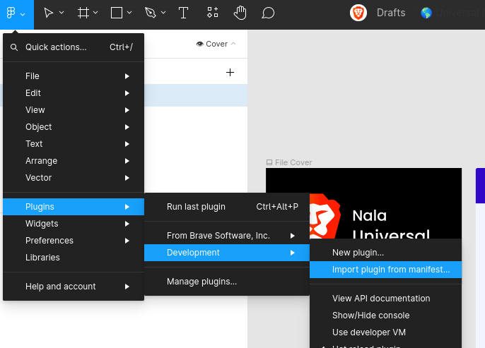
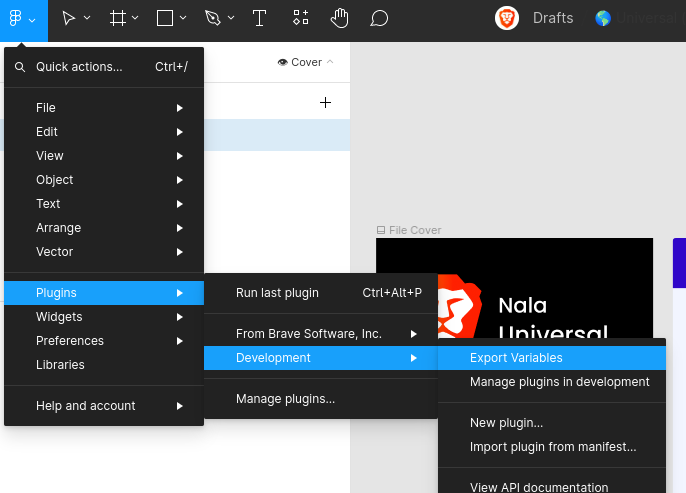
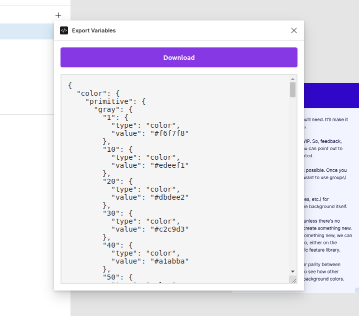

# Figma Variables Exporter

This repository contains a Figma plugin for exporting Figma variables, in a
format which [Nala](https://github.com/brave/leo) can understand.

## Development

1. Clone the repo
2. Install packages `npm install`
3. Build the package `npm run watch`
4. Load the plugin folder in Figma

## Usage

1. Download the latest release
2. Unzip the files
3. Load a new development plugin in Figma  in the file you want to export the variables from.
4. Run the plugin 
5. When the variables are ready, you should be able to download them 
